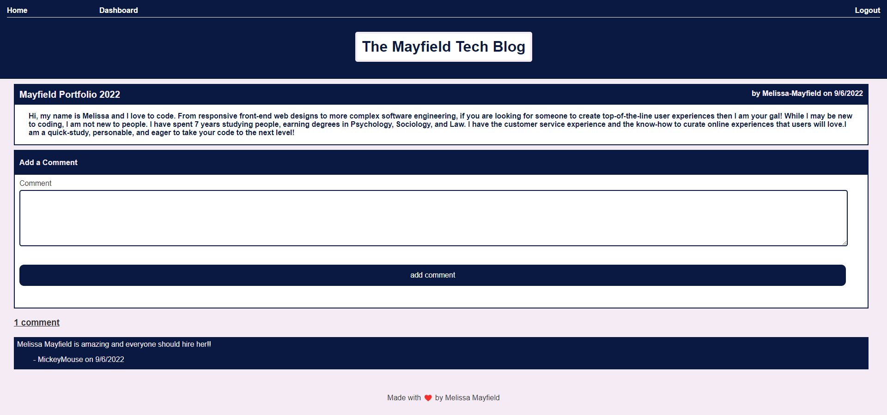

# Mayfield-Tech-Blog

This repo houses the code used to build the Mayfield Tech Blog available at https://mayfield-tech-blog.herokuapp.com/home.

## The Blogg

The Mayfield Tech Blog app provides a secure platform for users to blog about the latests trends in technology. Users can sign-up, login, post blog entries, comment on blog entries, and maintain their own personal dashboard. 

## Tools

* The app was built and developed using Visual Studio Code (VS Code). 
* MySQL was used to create and connect to a database
* Sequelize was used to maintain and manipulate the database. 
* Node.js was used to code the app/db logic.
* Express.js was used to create a server and connect it to our database.
* Insomnia was used to test api routes.
* Github hosts the repository.
* Heroku hosts the deployed website and utilizes JawsDB to host the remote server/database.

## Installation

Access deployed link at https://mayfield-tech-blog.herokuapp.com/home .

## Credits

Made with ❤️ by Melissa Mayfield

